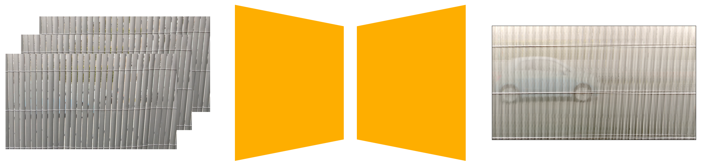

# Problem Statement

# Goal

# Workflow
The thesis can be combined with an Informatik Praktika. Please, do not forget to attend the mandatory <a href="https://cvl.tuwien.ac.at/teaching/diplomarbeiten/allgemeine-hinweise-zu-masterarbeiten/">courses</a> (as well for the <a href="https://cvl.tuwien.ac.at/teaching/informatik-praktika/allgemeine-hinweise-zu-bachelorarbeiten-und-praktikas/">Praktika</a>). You will write a thesis proposal at the beginning where you are welcome to formulate your own research ideas in agreement with the supervisor.
<h3>Requirements</h3>
<ul>
 	<li>Basic knowledge in computer vision or computer graphics (e.g. Master Programmes Visual Computing, Data Science)</li>
 	<li>Basic experience in C++, Python, Julia</li>
 	<li>Interest in machine learning, maths, statistics</li>
 	<li>Interest in collaborating internationally with others</li>
</ul>
