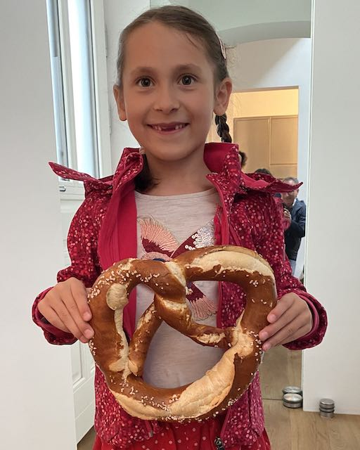

I am a Marie Curie fellow in the [Department of Informatics](https://www.in.tum.de/en/) at the University of Munich. I am member of the [Dynamic Vision and Learning Group](https://dvl.in.tum.de) at the [Chair of Computer Vision and Artificial Intelligence](https://cvai.in.tum.de).
I am also a fellow in the [Department of Computer Science](https://www.cs.technion.ac.il) at the Technion, Israel, where I am a member of [Michael Lindenbaum's Group](https://mic.net.technion.ac.il). I am supported by the [EuroTech PostDoc2 Programme](https://postdoc2.eurotech-universities.eu/our-fellows-2/) of the EuroTech Universities.

I am lecturer in the [Faculty of Informatics](https://informatics.tuwien.ac.at) at TU Wien where I am member of the [Computer Vision Lab](https://cvl.tuwien.ac.at) at the Institute of Visual Computing & Human-Centered Technology.

I am Scientist at the [AIT Austrian Institute of Technology](https://www.ait.ac.at) where I am currently on leave.

I received in 2002 a MSc degree in Informatics at the TU Wien. In 2001, I spent one year with a [Kurt Goedel stipend](https://kgs.logic.at) at the Queensland University of Technology, Australia. I received in 2008 a PhD in Telematics at the TU Graz, Austria.

I was awarded in 2008 with a Viennese [WWTF](https://www.wwtf.at/index.php?lang=EN) Career Grant. I received in 2014 the IEEE/CvF WACV Best Paper Award and in 2019 the CVPR Outstanding Reviewer award.

In my free time I like to walk, hike, swim and ride my bike.

Please, see my [CV](assets/docs/sci-cv-pflugfelder.pdf) for more details.

I am programming in  
  

