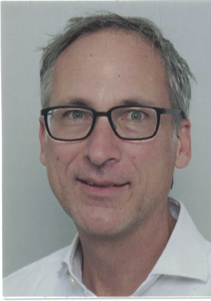

### News
* I started January 1, 2022 as Marie Curie Fellow at TUM and Technion

### Students
I am currently looking for students.

### My Past Students
* Jonas Auer, Robust Object Localisation under Fragmented Occlusion, Master's thesis, 2022
* Èric Quintana Aguasca, Tracking by Detection Using Yolo and a Kalman Filter, [Bachelor's thesis](https://upcommons.upc.edu/bitstream/handle/2117/357892/Final_Thesis_TrackingByDetection_Quintana_Aguasca.pdf?sequence=2&isAllowed=y), 2021 - Erasmus cooperation with [Xavier Giro](https://imatge.upc.edu/web/people/xavier-giro), UPC Barcelona
* [Caroline Magg](https://www.linkedin.com/in/caroline-magg-7288ba210/), Deep Image Prior for Microscopy Images, [Praktika](https://cvl.tuwien.ac.at/wp-content/uploads/2021/06/DIP_Project_CarolineMagg_red.pdf), 2021
* [Gustav Häger](https://www.linkedin.com/in/gustav-häger-25a22941/?originalSubdomain=se), Learning Visual Perception for Autonomous Systems, Opponent in his Doctoral Defense at [Linköping University](https://liu.se/en/employee/micfe03, June, 2021
* [Julian Wagner](https://www.linkedin.com/in/julian-wagner-68b637127/), Detecting Vehicles in Satellite Video Using Deep Networks, [Master's thesis](https://repositum.tuwien.at/bitstream/20.500.12708/16185/2/Wagner%20Julian%20-%202020%20-%20Detecting%20Moving%20Vehicles%20in%20Satellite%20Videos%20Using%20Deep...pdf), 2020
* [Manuel Danner](https://www.linkedin.com/in/manuel-danner), Semantic Segmentation of Image Sequences Using a Spatio-Temporal U-Net, [Master's thesis](https://repositum.tuwien.at/bitstream/20.500.12708/15636/2/Danner%20Manuel%20-%202020%20-%20Semantic%20Segmentation%20of%20Image%20Sequences%20Using%20a...pdf), [Code](https://github.com/Mastercorp/SiamU-Net), 2020 - now at [Trayport](https://www.trayport.com)

