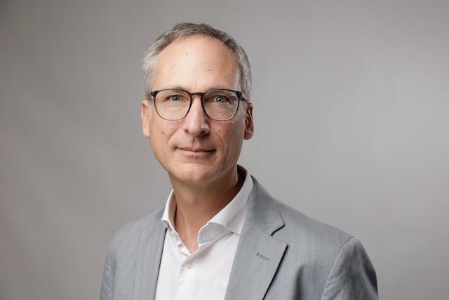

{:style="display:block; margin-left:auto; margin-right:auto"}

I am a [EuroTech](https://eurotech-universities.eu) Marie Curie fellow of the Technical University Munich and the Technion in Haifa, Israel. I am member of [Daniel Cremer's](https://vision.in.tum.de/members/pfl) and [Michael Lindenbaum's](https://mic.net.technion.ac.il) group.

Since 2007, I have worked in the position of a Scientist at the [AIT Austrian Institute of Technology](https://www.ait.ac.at) and as a lecturer in the [Computer Vision Lab](https://cvl.tuwien.ac.at) at TU Wien where I built 2008-2015 as a manager of governmental and EU funded projects a team of six researchers. I coordinated 2012-2016 AIT's strategic programme [Mobile Vision](https://www.ots.at/presseaussendung/OTS_20130910_OTS0063/ait-und-tu-graz-buendeln-staerken-in-der-internationalen-bildverarbeitungsforschung-bild) which was a cooperation among AIT, [Thomas Pock](https://www.tugraz.at/institute/icg/research/team-pock/people/pock/), TU Graz and [Bernhard Rinner](https://bernhardrinner.com), University of Klagenfurt.

A [Kurt Goedel stipend](https://kgs.logic.at) allowed me to pursue 2001-2002 a master's degree in Computer Science and Informatics under the supervision of [Brian Lovell](https://staff.itee.uq.edu.au/lovell/) and Horst Bischof at the Queensland University of Technology, Australia and TU Wien. I graduated in 2008 under supervision of [Horst Bischof](https://www.tugraz.at/institute/icg/research/team-bischof/people/team-about/horst-bischof/) with a PhD in Telematics at TU Graz.

I was awarded for my scientific contributions in 2008 with a Viennese [WWTF](https://www.wwtf.at/index.php?lang=EN) Career Grant and in 2014 with the IEEE/CvF WACV Best Paper Award. I received several reviewer awards (2016 - J. of Image and Vision Computing, 2017 - J. of Pattern Recognition, 2019 - CVPR) for my community work. In 2012, I founded together with [Matej Kristan](https://www.vicos.si/people/matej_kristan/) the [VOT challenges and workshop series](https://www.votchallenge.net) which we organised together with many other colleagues 2013-2022 at ICCV and ECCV.

Technologies such as my 2001 [traffic monitor](https://sciencev1.orf.at/news/35843.html), the [CMT](https://www.gnebehay.com/cmt/) tracker or the indoor localisation of our [surveillance camera calibration](https://link.springer.com/content/pdf/10.1007/978-3-319-16199-0_12.pdf) were successfully used by governmental organisations and companies for applications in robotics and surveillance.

My hobbies are walking, hiking, swimming and riding my bike.

Please, see my [CV](assets/docs/sci-cv-pflugfelder.pdf) for more details.

<!---
 I am programming in  

 
--->
